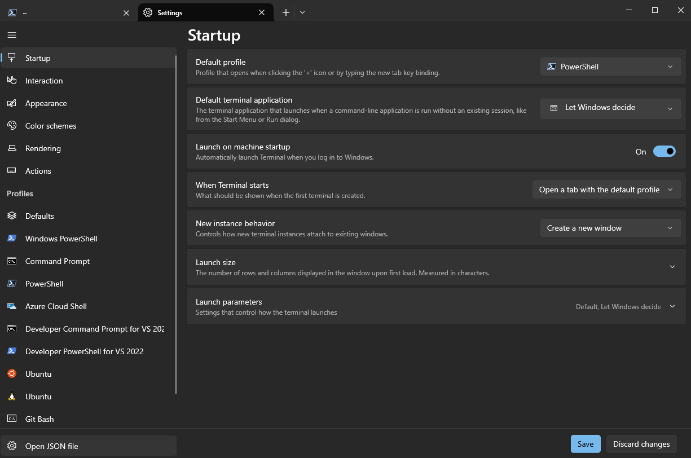
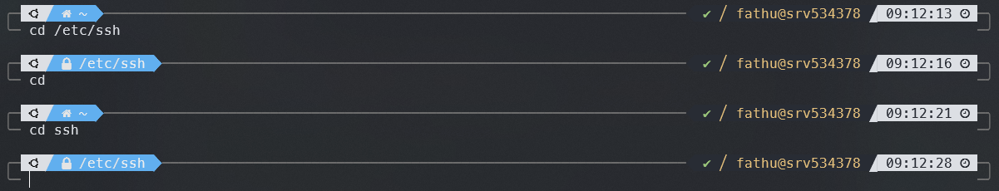

# Setup Terminal VPS

Biar tampilan terminal vps kita lebih menarik, gua mau setup terminal vps Ubuntu 24.04 gua menggunakan [zsh](https://github.com/ohmyzsh/ohmyzsh/wiki/Installing-ZSH), [Oh My Zsh!](https://github.com/ohmyzsh/ohmyzsh), [powerlevel10k](https://github.com/romkatv/powerlevel10k) dan [zsh-autosugesstions](https://github.com/zsh-users/zsh-autosuggestions). Gua juga mau install [zoxide](https://github.com/ajeetdsouza/zoxide) + [fzf](https://github.com/junegunn/fzf) biar navigasi ke folder-folder lebih gampang.

## Install zsh & Oh My Zsh!

zsh merupakan terminal biasa seperti `bash`, `cmd`, `powershell`, dll. Dengan menginstall Oh My Zsh!, kita dapat menggunakan plugin dan tema untuk terminal zsh kita. Langsung aja kita install `zsh`-nya terlebih dahulu

```bash
sudo apt update -y && sudo apt upgrade -y

sudo apt install zsh -y
```

Cek apakah zsh sudah terinstall atau belum

```bash
zsh --version

# expected >>> zsh 5.9 or similiar
```

Sekarang atur `zsh` sebagai terminal default

```bash
chsh -s $(which zsh)
```

Coba kita logout dulu dan masuk lagi ke vps-nya untuk ngecek kalo `zsh` sudah jadi terminal default kita. Kalo berhasil, kita diminta untuk konfigurasi awal zsh kita.


Untuk saat ini kita ketik `0` aja untuk buat configuration filenya aja. nanti mungkin akan kita ubah ketika udah mulai install powerlevel10k. Kalo mau liat isi file konfigurasinya bisa jalankan `nano ~/.zshrc`.

Selanjutnya kita install `Oh My Zsh!` dengan menjalankan

```bash
sh -c "$(curl -fsSL https://raw.githubusercontent.com/ohmyzsh/ohmyzsh/master/tools/install.sh)"
```

kalo berhasil, hasilnya kaya gini:


Sampe sini, udah cukup bagus ya terminalnya, lebih berwarna dan simple. Biar lebih mantep, gua mau pasang tema `powerlevel10k`.

## Install powerlevel10k

Btw, di laptop windows, gua menggunakan aplikasi terminal dari windows store dengan default profile-nya PowerShell


Pada menu Settings > Defaults > Appearance, gua menggunakan Color schema "One Half Dark" dan Font face [MesloLGS NF](https://github.com/romkatv/powerlevel10k?tab=readme-ov-file#meslo-nerd-font-patched-for-powerlevel10k) sesuai dengan rekomendasi font dari `powerlevel10k`


Kalo udah setting terminalnya dengan font "MesloLGS NF", kita lanjut install `powerlevel10k`

```bash
git clone --depth=1 https://github.com/romkatv/powerlevel10k.git ${ZSH_CUSTOM:-$HOME/.oh-my-zsh/custom}/themes/powerlevel10k
```

Buka konfigurasi zsh (`nano ~/.zshrc`), ganti `ZSH_THEME` menjadi:

```bash
ZSH_THEME="powerlevel10k/powerlevel10k"
```

Notes: simpan dengan `Ctrl+X`, `y`, `Enter`.

Selanjutnya kita restart zsh dengan `exec zsh`. Akan muncul prompt konfigurasi dari powerlevel10k seperti ini:


Notes: kalo gk muncul prompt-nya coba jalanin `p10k configure`

Silahkan setting sesuai keinginan kalian, kalo gua kurang lebih kaya gini settingnya:

`y > y > y > y > 3 > 1 > 2 > 3 > 3 > 1 > 2 > 3 > 4 > 2 > 2 > 1 > n > 1 > y`

Kurang lebih hasilnya akan seperti ini:


## Install zsh-autosuggestions

Biar terminalnya ada autosuggestions-kita install plugin `zsh-autosuggestions`

```bash
git clone https://github.com/zsh-users/zsh-autosuggestions ${ZSH_CUSTOM:-~/.oh-my-zsh/custom}/plugins/zsh-autosuggestions
```

Tambahin plugin-nya di file `~/.zshrc` (`nano ~/.zshrc`) pada bagian `plugins`

```bash
plugins=(
    # other plugins...
    git
    zsh-autosuggestions
)
```

Restart zsh dengan `exec zsh`, kalo berhasil akan muncul suggestion berdasarkan histori command kita.


## Install zoxide + fzf

Last but no least, kita install zoxide agar memudahkan navigasi. Misal dari `/home/user` kita mau masuk ke folder aplikasi kita yaitu `my-app` yang ada di `/app/project`. Normalnya kita akan menjalankan:

```bash
cd /app/project/my-app
```

Nah, kalo pake zoxide, asalkan udah pernah masuk ke direktori `my-app` sebelumnya, dari manapun kita cukup jalankan `cd my-app`. Ibaratnya zoxide ini kaya fitur search untuk nyari folder-folder yang udah pernah dikunjungi.

Langsung aja install

```bash
curl -sSfL https://raw.githubusercontent.com/ajeetdsouza/zoxide/main/install.sh | sh
```

kita install juga `fzf` untuk command-line fuzzy finder.

```bash
sudo apt install fzf
```

Tambahkan script berikut di `~/.zshrc` di line paling bawah

```bash
# Export PATH for zoxide
export PATH="$HOME/.local/bin:$PATH"

# =============================================================================
#
# Utility functions for zoxide.
#

# pwd based on the value of _ZO_RESOLVE_SYMLINKS.
function __zoxide_pwd() {
    \command cygpath -w "$(\builtin pwd -P)"
}

# cd + custom logic based on the value of _ZO_ECHO.
function __zoxide_cd() {
    # shellcheck disable=SC2164
    \builtin cd -- "$@"
}

# =============================================================================
#
# Hook configuration for zoxide.
#

# Hook to add new entries to the database.
function __zoxide_hook() {
    # shellcheck disable=SC2312
    \command zoxide add -- "$(__zoxide_pwd)"
}

# Initialize hook.
# shellcheck disable=SC2154
if [[ ${precmd_functions[(Ie)__zoxide_hook]:-} -eq 0 ]] && [[ ${chpwd_functions[(Ie)__zoxide_hook]:-} -eq 0 ]]; then
    chpwd_functions+=(__zoxide_hook)
fi

# =============================================================================
#
# When using zoxide with --no-cmd, alias these internal functions as desired.
#

__zoxide_z_prefix='z#'

# Jump to a directory using only keywords.
function __zoxide_z() {
    # shellcheck disable=SC2199
    if [[ "$#" -eq 0 ]]; then
        __zoxide_cd ~
    elif [[ "$#" -eq 1 ]] && { [[ -d "$1" ]] || [[ "$1" = '-' ]] || [[ "$1" =~ ^[-+][0-9]$ ]]; }; then
        __zoxide_cd "$1"
    elif [[ "$@[-1]" == "${__zoxide_z_prefix}"?* ]]; then
        # shellcheck disable=SC2124
        \builtin local result="${@[-1]}"
        __zoxide_cd "${result:${#__zoxide_z_prefix}}"
    else
        \builtin local result
        # shellcheck disable=SC2312
        result="$(\command zoxide query --exclude "$(__zoxide_pwd)" -- "$@")" &&
            __zoxide_cd "${result}"
    fi
}

# Jump to a directory using interactive search.
function __zoxide_zi() {
    \builtin local result
    result="$(\command zoxide query --interactive -- "$@")" && __zoxide_cd "${result}"
}

# Completions.
if [[ -o zle ]]; then
    function __zoxide_z_complete() {
        # Only show completions when the cursor is at the end of the line.
        # shellcheck disable=SC2154
        [[ "${#words[@]}" -eq "${CURRENT}" ]] || return 0

        if [[ "${#words[@]}" -eq 2 ]]; then
            _files -/
        elif [[ "${words[-1]}" == '' ]] && [[ "${words[-2]}" != "${__zoxide_z_prefix}"?* ]]; then
            \builtin local result
            # shellcheck disable=SC2086,SC2312
            if result="$(\command zoxide query --exclude "$(__zoxide_pwd)" --interactive -- ${words[2,-1]})"; then
                result="${__zoxide_z_prefix}${result}"
                # shellcheck disable=SC2296
                compadd -Q "${(q-)result}"
            fi
            \builtin printf '\e[5n'
        fi
        return 0
    }

    \builtin bindkey '\e[0n' 'reset-prompt'
    [[ "${+functions[compdef]}" -ne 0 ]] && \compdef __zoxide_z_complete __zoxide_z
fi

# =============================================================================
#
# Commands for zoxide. Disable these using --no-cmd.
#

\builtin alias cd=__zoxide_z
\builtin alias cdi=__zoxide_zi

# =============================================================================
#
# To initialize zoxide, add this to your configuration (usually ~/.zshrc):
#
eval "$(zoxide init zsh)"
```

Apply konfigurasi dengan command `source ~/.zshrc`. Kemudian kita coba masuk ke direktori `/etc/ssh` dan balik lagi `user`.

```bash
cd /etc/ssh
cd
```

Nah, kalo sudah cukup dengan command `cd ssh`, kita akan masuk ke direktori `/etc/ssh`


Terakhir, jalankan command `cdi` untuk melihat direktori yang telah disimpan zoxide. Arahkan kursor untuk memilih direktori yang dituju


## Penutup

Alright, cukup segini aja untuk setup terminal vps-nya. Bye 😎
