# Setup VPS Ubuntu 24.04

Kali ini gua akan setup vps dengan OS Ubuntu 24.04. gua akan mulai setup vps dari pertama kali masuk ke vps melalui terminal powershell di laptop windows gua. Untuk setup basic-nya gua ngikutin setup-annya kang [Dea Afrizal](https://www.youtube.com/@deaafrizal) (bisa ditonton di [YouTube](https://www.youtube.com/watch?v=kgj18fGXuac)).

## Update dan upgrade apt

Sebelum kita setup vps, baiknya kita update dan upgrade apt kita untuk memastikan package-package yang ada terupdate.

```bash
sudo apt update -y  && sudo apt upgrade -y
```

## Install neofetch

Biar gaya, kita install neofetch untuk nampilin spesifikasi vps kita.

```bash
sudo apt install neofetch -y
neofetch
```

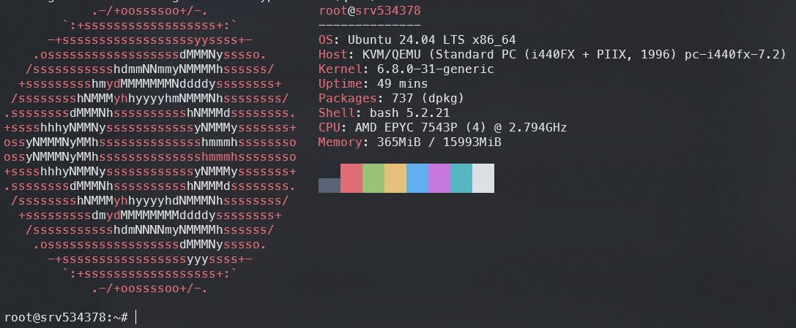

## Add User

Saat pertama kali kita masuk ke vps, pasti kita akan menggunakan `root` user. Nah, karena `root` user ini bisa akses segala macem permission, gua akan bikin user baru agar nantiya gua bisa masuk ke vps tanpa pakai `root` user. Kita bisa bikin user baru dengan menggunakan `root` user dan menjalankan command:

```bash
adduser {username} // ganti {username} dengan username kalian
```

Setelah itu akan muncul beberapa pertanyaan terkait pembuatan user dan kalian bisa isi sesuai kebutuhan.

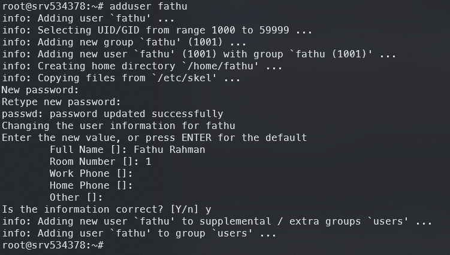
Notes: ketika kita ketik passwordnya, emang gk keliatan di terminal jadi ketik aja yang sesuai dan pastiin pas retype passwordnya juga bener

Terus masih menggunakan `root` user, gua mau nambahin user yang udah dibikin ke group `sudo` biar user ini bisa install-install pake `sudo`

```bash
usermod -aG sudo {username}
```

Kalo udah berhasil, coba masuk pake user yang baru dengan command `su - {username}`. Kalo berhasil nanti tampilannya kaya gini:

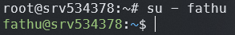

kita cek groups nya

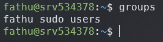

Nah, skrg kita bisa pake sudo di user yang baru kaya gini:

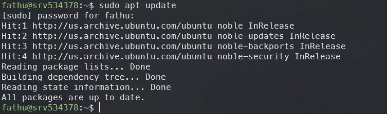

Ketik command `su -` untuk balik login ke `root` user

## Config SSH

By default, ketika kita masuk ke vps menggunakan ssh, maka kita akan masuk menggunakan port 22 dan kita juga bisa masuk menggunakan `root` user. Gua akan config ssh agar port yang digunakan sesuai keinginan gua dan untuk `root` user gak boleh masuk pakai ssh. Kita login dengan `root` user kemudian buka file /etc/ssh/sshd_config menggunakan `nano`:

```bash
nano /etc/ssh/sshd_config
```

cari bagian `#Port 22` tambahin 1 baris dengan port yang kalian mau misalnya `Port 1234`.

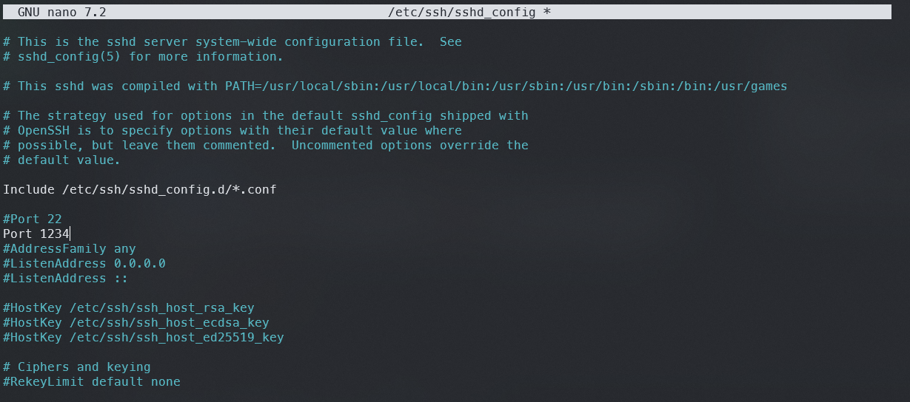

cari lagi di paling bawah ada bagian `PermitRootLogin yes` kita ganti jadi `PermitRootLogin no`

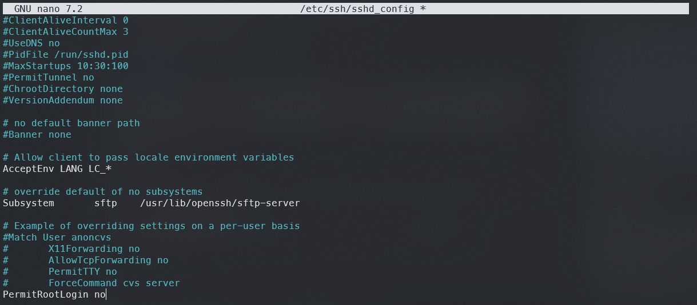

save dengan tekan `Ctrl+X`, `y`, dan `Enter`.

Restart service ssh dengan command `systemctl restart sshd`

Notes: kalau muncul error sshd.service not found bisa lakukan command berikut:

```bash
systemctl disable ssh.socket
systemctl stop ssh.socket

systemctl disable ssh.service
systemctl enable ssh.service

systemctl restart sshd
```

Kemudian pastiin portnya udah keganti kaya gini:

```bash
sudo systemctl status ssh
```

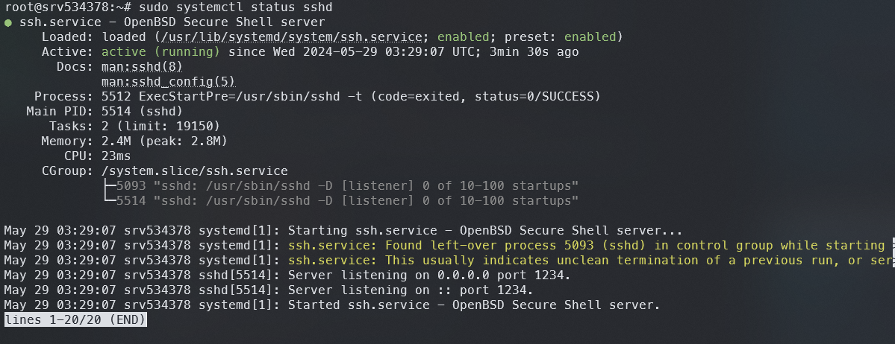

### Test hasil config SSH

Buka terminal baru, harusnya kalian udah gabisa masuk vps kaya gini

```bash
ssh {username}@{ip_vps}

output >>> ssh: connect to host {ip_vps} port 22: Connection timed out
```

Notes: kalo masih bisa connect coba reboot vpsnya

kita tambahin opsi `-p 1234` biar bisa masuk menggunakan user selain `root`

```bash
ssh {username}@{ip_vps} -p 1234
```

Terus kalo mau login pake `root` user bisa jalankan `su -` kaya gini

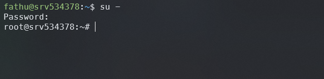

## Setup Firewall with UncomplicatedFirewall (ufw)

kalo pake ubuntu seharusnya udah ada package `ufw`. Untuk memastikannya jalankan `ufw status` dan harusnya masih inactive. Sebelum mengaktifkan `ufw` kita harus allow port ssh yang kita udah config sebelumnya, kalo nggak kita gabisa masuk lagi ke vpsnya (kejadian di gue soalnya wkwk 🤣). jalankan `ufw allow 1234/tcp` untuk allow port ssh yang sesuai dengan config-nya. Kemudian enable ufw `ufw enable` dan cek statusnya `ufw status`

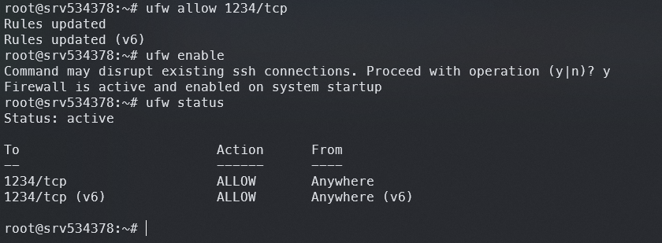

Jangan logout dulu dari session `root`, Coba pastiin kita bisa masuk ke vps di terminal baru.

## Setup Nginx

Sampai sekarang ketika kita akses ip public vps-nya melalui browser harusnya belum ada konten apa-apa (loading lama dan connection timeout). Sekarang kita coba install [nginx](https://nginx.org/en/) untuk menampilkan html sederhana dari vps kita. Jalankan command berikut:

```bash
sudo apt install nginx -y
```

Karena kita udah setup `ufw` sebelumnya, kita belom bisa akses ip public melalui browser dengan protcol http/https. jalankan command `ufw allow http && ufw allow https` (pake `sudo` kalo bukan `root` user) kemudian coba akses ip public melalui browser. Seharusnya akan keluar halaman `Welcome to nginx!`.

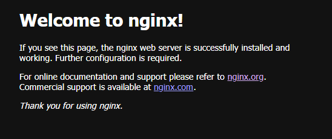

kalo nggak keluar coba reload ufw nya dengan command `ufw reload` dan cek list port yang di-allow dengan `ufw status`. Pastikan sudah ada port 80 (http) dan 443 (https).

Kalo mau ganti isi html-nya bisa edit file nya dengan command `nano /var/www/html/index.nginx-debian.html` atau hapus file itu dan bikin file `index.html` di direktori `/var/www/html`.

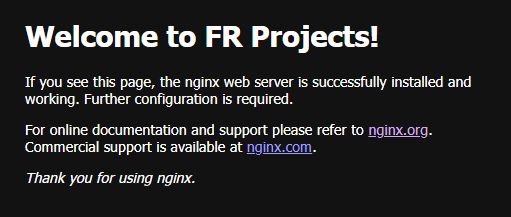

## Penutup

Alright! cukup segini dulu gess setup vps-nya. After ini gua mau coba setup terminal menggunakan [ohmyzsh](https://github.com/ohmyzsh/ohmyzsh/wiki/Installing-ZSH), [powerlevel10k](https://github.com/romkatv/powerlevel10k), [zsh-autosuggestions](https://github.com/zsh-users/zsh-autosuggestions/blob/master/INSTALL.md), [fzf](https://github.com/junegunn/fzf) , dan [zoxide](https://github.com/ajeetdsouza/zoxide). Setelah itu baru kita belajar deploy-deploy aplikasi yang kita udah develop. Bye 😎
